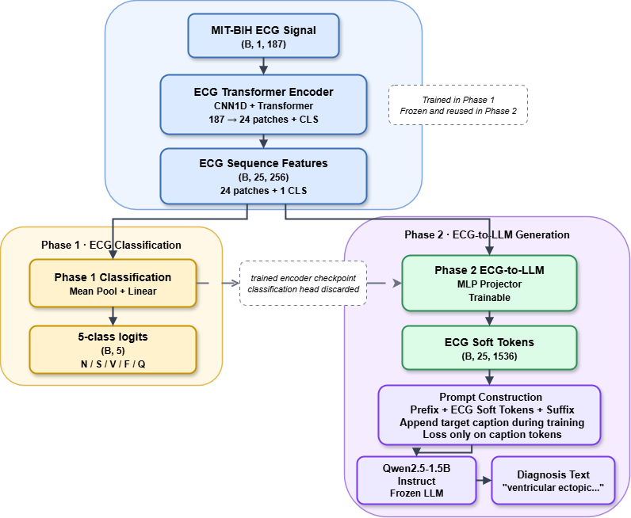

# ECG Encoder

ECG Encoder is a two-stage ECG understanding project for MIT-BIH heartbeat classification and ECG-to-language diagnosis generation.

## Overview

The project contains two phases:

1. **ECG Transformer encoder**: a wav2vec 2.0 / ECG-FM style encoder trained from scratch on MIT-BIH heartbeat data for 5-class arrhythmia classification.
2. **ECG + LLM alignment**: a LLaVA-style stage-1 setup that freezes the ECG encoder and Qwen2.5-1.5B-Instruct, then trains an MLP projector so the LLM can generate natural-language ECG diagnoses.

Reported results from the project notes:

- Phase 1 ECG classifier macro F1: **0.8625**
- Phase 2 LLM generation + parsed classification macro F1: **0.9057**

## Dataset

The project uses the MIT-BIH subset from the Kaggle heartbeat dataset:

- Source: `shayanfazeli/heartbeat`
- Files: `mitbih_train.csv`, `mitbih_test.csv`
- Signal format: single-lead ECG, 187 samples per record
- Labels: 5 classes `{0: N, 1: S, 2: V, 3: F, 4: Q}`

Data files are not included in this repository. Put them under `data/` before training or evaluation.

## Repository structure

```text
.
├── config.yaml              # Phase 1 ECG classifier config
├── config_lm.yaml           # Phase 2 ECG-LLM projector config
├── config_lm_lora.yaml      # LoRA-related config
├── requirements.txt
├── scripts/
│   └── extract_data.sh
└── src/
    ├── data/                # MIT-BIH dataset loader and caption templates
    ├── model/               # ECG encoder, projector, and ECG-LLM modules
    ├── train.py             # Phase 1 training
    ├── evaluate.py          # Phase 1 evaluation
    ├── train_lm.py          # Phase 2 projector training
    ├── evaluate_lm.py       # Phase 2 evaluation
    └── train_lm_lora.py     # LoRA fine-tuning
```

## Installation

```bash
pip install -r requirements.txt
```

## Usage

### Train the ECG classifier

```bash
python -m src.train --config config.yaml
```

### Evaluate the ECG classifier

```bash
python -m src.evaluate --config config.yaml
```

### Train the ECG-LLM projector

```bash
python -m src.train_lm --config config_lm.yaml
```

### Evaluate the ECG-LLM model

```bash
python -m src.evaluate_lm --config config_lm.yaml
```

## Model architecture



The Phase 1 classifier uses:

- 1D CNN feature extractor with 3 stride-2 convolution blocks
- Transformer backbone with 4 layers, hidden size 256, and 4 attention heads
- Mean pooling over patch tokens followed by a linear 5-class head

The Phase 2 model uses:

- Frozen ECG encoder
- MLP projector from ECG token embeddings to LLM embedding space
- Frozen Qwen2.5-1.5B-Instruct language model

### Soft tokens and ChatML prompt

**ECG soft tokens** are continuous embedding vectors generated from ECG features, not readable text tokens. The MLP projector maps the ECG encoder output into the same embedding dimension used by the LLM, so these ECG embeddings can be inserted directly into the LLM input sequence. This allows the language model to condition on ECG information without first converting the signal into plain text.

**ChatML** is the chat prompt format used to wrap the instruction for the Qwen Instruct model. In this project, the LLM input is built by combining normal text prompt embeddings with the ECG soft tokens:

```text
Prefix prompt + ECG soft tokens + Suffix prompt + Target diagnosis text
```

During training, the target diagnosis text is appended after the prompt. The loss is calculated only on the target diagnosis tokens, so the model learns to generate the diagnosis from the ECG information rather than learning to reproduce the prompt itself.

